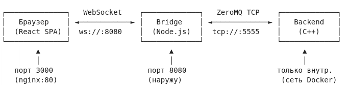
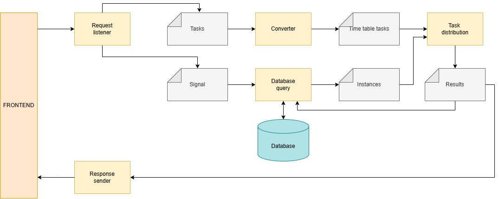

# Сервис планирования рабочих маршрутов для инженеров с учетом временных окон и сложности проводимых работ
## Краткое описание

Проект представляет собой клиент-серверное приложение предназначенное для решения VRP-задачи (одной из ключевых задач в логистике). Такая задача, как правило, сопровождается какими-то дополнительными требованиями. К таковым относятся:
    
    - выполнение задачи за отведенное время;
    - выполнение абсолютно всех задач;
    - затраты должны быть минимальны;
    - каждый исполнитель стартует из своей точки;
и т.д.

Все эти требования в той или иной степени усложняют и без того трудную задачу. Получение идеального решения (например, путем перебора всех вариантов назначений) не является верным, т. к. процесс вычисления для большого количества задач слишком долгий и требует колоссального количества ресурсов. Особенно, если решение сильно восприимчиво к окржающей среде (например, должна учитываться дорожная ситуация), то с точки зрения простого перебора это задача вообще практически не разрешима или не имеет смысла. Поэтому обычно применяют приближенные методы с ипсользованием эвристик.

В данном проекте предлагается способ решения, в котором учитываются следующие ситуации:

    - задачи должны быть выполнены в указанный период времени (временные окна);
    - каждый исполнитель задач может начинать с разных позиций (мультидепо);
    - для исполнителей установлен строгий рабочий график;
    - у каждого исполнителя свйо уровень компетенции;
    - каждая задача требует определенного уровня компетенций от исполнителя;
    - каждая задача выполняется со своей определенной длительностью;
    - возможны появления новых срочных задач в течение дня;
    - возможны отмены уже назначенных срочных задач;
    - каждый сотрудник может перемещаться своим способом (автомобиль, пешком, общественный транспорт и т. д.).


## Входные данные

По задумке данные для обработки поступают с клиентской части приложения в серверную. Причем между клиентской и серверной частями имеется неким мост, позволяющий 
использовать специальные фреймворки для более высокой производительности.




Входные данные отправляемые клиентской частью в серверную представляются в виде следующей таблицы:

| **Заявка** | **Тип заявки BK** |	**Тип заявки HD** |	**Начало** | **Окончание** | **Район** | **Адрес** | **Гигабитное подключение** |
|---|---|---|---|---|---|---|---|
| 32840 | Подключение |	Конвергенция абонента | 17.08.2026 18:00 | 17.08.2026 20:00 | Даниловский	Город Москва, проезд.3-й Павелецкий, д. 9 | Нет
| 78540 | Подключение |	Конвергенция абонента | 17.08.2026 18:00 | 17.08.2026 20:00 | Даниловский	Город Москва, ул.Восточная, д. 2 к 2 | Нет
| 66376 | Подключение |	Конвергенция абонента | 17.08.2026 18:00 | 17.08.2026 20:00 | GPON Даниловский	Город Москва, ул.Дубининская, д. 59 к 2	| Нет
| 23637 | Подключение |	Конвергенция абонента | 17.08.2026 20:00 | 17.08.2026 22:00 | Академический	Город Москва, ул.Шверника, д. 18 к 2 | Нет
| 97770 | Подключение |	Конвергенция абонента | 17.08.2026 20:00 | 17.08.2026 22:00 | Котловка	Город Москва, ул.Нагорная, д. 44 к 2 | Нет
| ... | ... | ... | ... | ... | ...	| ... | ...

Из этих данных при помощи геокодирования для каждого адреса определяются геодезические координаты (широта, долгота) и строится матрица времени пути для каждого профиля (автомобиль, пешеход, велоспиед и т.д.). Количество профилей должно настраиваться конфигурацией. 

Примечание! Чем больше используется профилей, тем больше будет построено временных матриц путей. Одна строка матрицы показывает сколько по времени двигаться от одной точки до всех остальных.

Причем размер матрицы равен 

    $ (N + M) * (N + M) $,

где N - количество исполнителей задач, M - количество самих задач 

Полученные данные конвертируются в сообщение формата json:

```bash
#--------------- ОПИСАНИЕ СФОРМИРОВАННЫХ ЗАЯВОК В ФОРМАТЕ JSON --------------------
{
    "generatedAt": "2026-09-27T23:28:25.461Z",
    "time": "17.08.2026 8:00",
    "source": "OSRM (router.project-osrm.org)",
    "units": "seconds",
    "pointCount": 67,
    "points": 
    [
        {
          "index": 11,
          "task_uid": 305894566,
          "task_type": "connection",
          "task_region": "yugotsentr",
          "lat": 55.710748,
          "lon": 37.6403,
          "time_window": {
            "time_begin": "17.08.2026 18:00",
            "time_end": "17.08.2026 20:00"
          }
        },
    ...
    ],
    "matricies": 
    [
        {
        "profile": ...,
        "matrix":
        [[ ... ],
        ...]
        },
        ...
    ]
}
```

Следует отметить, что данные об исполнителях задач (сотрудники, инженеры) в момент отправки сообщения с заявками должны быть уже в серверной части (базе данных).
Данное приложение позволяет имитировать регистрацию исполнителей задач (сотрудников). 
Формат входного сообщения по исполнителям задач:

```bash
#------------------ ОПИСАНИЕ СООБЩЕНИЯ ДЛЯ РЕГИСТРАЦИИ СОТРУДНИКОВ В БАЗЕ ДАННЫХ ------------------
{
    "instances":
    [
        {
            "instance_uid": ...,
            "instance_name": ...,
            "intance_region": ...,
            "instance_moving_type": ...,
            "instance_start_position":
            {
                "longitude": ...,
                "latitude": ...
            },
            "instance_competence":
            [
                ...
            ]
        },
        ...
    ]
}
```


## Архитектура серверной части

Архитектура серверной части выглядит следующим образом



Это многопоточное приложение, в котором каждая компонента выполняет свою роль. Сердцем данной системы является модуль (функциональная компонента) task_distribution, который собственно и распределяет задачи между доступными исполнителями.

Компоненты полученной системы:

| **Компонента** | **Описание** |
|---|---|
| request_listener | Модуль приема пользовательских запросов. Является входной точкой обработки данных. |
| converter | Модуль конвертации входных данных в форматы, требуемые для дальнейшей обработки. |
| database_query | Модуль формирования и выполнения запросов к базе данных в зависимости от типа пользовательского запроса. |
| task_distribution | Модуль распределения задач |

### Компонента task_distribution

Основной модуль распределения задач. Реализует логику назначения задач исполнителям с учётом ограничений и приоритетов, а также поддерживает динамическое переназначение при поступлении срочных задач.

Учитываемые параметры при распределении:
- стартовое положение всех исполнителей (мультидепо);
- временные окна выполнения задач;
- типы задач;
- компетенции (навыки) исполнителей;
- тип транспортного средства исполнителя.

Особенности работы:
- при поступлении задач высшего приоритета (например, аварийная заявка) модуль переназначит текущие задачи;
- при отмене уже назначенной исполнителя заявки модуль переназначит текущие задачи;
- переназначение производится с учётом текущего положения исполнителя и статуса текущих работ.

Модуль, реализующий оптимизационное решение задачи маршрутизации и назначения с использованием библиотеки VROOM.

Учитываемые факторы при построении оптимального плана:
- тип транспортного средства каждого исполнителя;
- компетенции исполнителей;
- временные окна исполнения задач;
- стартовые позиции всех исполнителей (поддержка мультидепо);
- длительность выполнения каждой задачи.

### Взаимодействие между компонентами

Компоненты взаимодействуют между через специальные интерфейсы. Архитектура взаимодействия между компонентами выглядит следующим образом:


Сообщения полученной системы:

| **Сообщение** | **Описание** |
|---|---|
| request_listener | Модуль приема пользовательских запросов. Является входной точкой обработки данных. |
| converter | Модуль конвертации входных данных в форматы, требуемые для дальнейшей обработки. |
| database_query | Модуль формирования и выполнения запросов к базе данных в зависимости от типа пользовательского запроса. |
| task_distribution | Модуль распределения задач |

####В результате работы компонент формируются внутренние сообщения различных типов:

Сообщения типа list_instances
Сообщение содержит список всех исполнителей.

Сообщения типа user_request
Этот тип описывает запросы, отправляемые пользователем.

Сообщения типа list_tasks
Содержит информацию о всех задачах.

Сообщения типа time_table
Сообщение содержит информацию о времени в пути от точки A до точки B в виде таблицы. Таблица может корректироваться в соответствии с текущей дорожной ситуацией.

### Выходные данные
По окончании распределения задач будет сформирован файл SOLUTION.JSON, в котором будет содержаться список маршрутов для исполнителей.

### Инициализация
Инициализируется начальное состояние. По методу выбора ближнего формируется список выполняемых задач (для каждой текущей задачи выбирается ближайшая по длительности перемещения). Полученный список как раз и является трэком для исполнителя. Данный трэк заполняется до тех пор, пока время обработки всех указываемых задач укладывается в рабочее время. Затем для следующего исполнителя формируется трэк. Заполнение трэками выполняется до тех пор, пока либо не будут распределены все задачи, либо рабочее время для всех исполнителей будет заполнено. В результате будет сформировано два списка: распределенные задачи и нераспределенные. А так же будет получено первое решение, которое принимаем за лучшее. Стоит отметить, что если длительность перемещения от задачи А к задаче В равна нулю, то считается, что расстояние бесконечно долгое.

### Поиск наилучшего решения.

Поиск наилучшего решения осуществляеться двумя компонентами: task_distribution и vroom_problem_solver.
Примечание. Логика модуля task_distribution и модуля vroom_problem_solver тесно связана: task_distribution управляет общей логикой и приоритетами, а модуль vroom_problem_solver выполняет непосредственную оптимизацию маршрутов и назначений.

#### Компонента task_distribution

Основной модуль распределения задач. Реализует логику назначения задач исполнителям с учётом ограничений и приоритетов, а также поддерживает динамическое переназначение при поступлении срочных задач.

Учитываемые параметры при распределении:
- стартовое положение всех исполнителей (мультидепо);
- временные окна выполнения задач;
- типы задач;
- компетенции (навыки) исполнителей;
- тип транспортного средства исполнителя.

Особенности работы:
- при поступлении задач высшего приоритета (например, аварийная заявка) модуль может переназначить текущие задачи;
- переназначение производится с учётом текущего положения исполнителя и статуса текущих работ.

#### Компонента решения задачи о назначениях vroom_problem_solver (на базе библиотеки VROOM)

Модуль, реализующий оптимизационное решение задачи маршрутизации и назначения с использованием библиотеки VROOM.

Учитываемые факторы при построении оптимального плана:
- тип транспортного средства каждого исполнителя;
- компетенции исполнителей;
- временные окна исполнения задач;
- стартовые позиции всех исполнителей (поддержка мультидепо);
- длительность выполнения каждой задачи.
